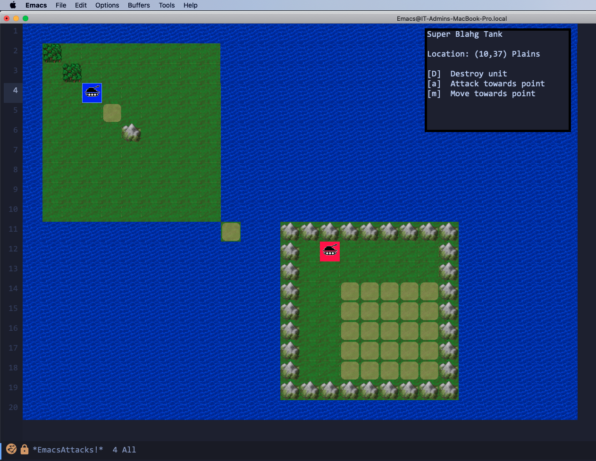

# emacs-attacks
Simple top-down wargame for Emacs

Why:
- .. because we needed a wargame in Emacs right? People can't complain there isn't one anymore!
- I wanted to learn Lisp and elisp in particular; failed spectacularly - this is not written in idiomatic lisp, and uses all terrible conventions. Thats what you get when hacking round at 2am .. but it works :)

How to run:
- Clone the git or otherwise unpack to somewhere
- Open up emattacks.el
- M-x eval-buffer
- .. "game" should be running

What does it do?
- as of Feb 2021, it just draws a lame map in its buffer, and a fake side-panel, and lets you cursor around
- immediate priorities are properly handlig the 'sprite list' (NPC and PC movable units, as opposed to map tiles); a few strategies for display (text properties? posframes? just replace map tile with the 'sprite' art..)
- proper side panel content and menus
- map painting, saving and loading
- hook people into working on mapscripts and AI scripts (bresenham bee line AI isn't very useful, especially with water in the way)
- large map handling (scrolling the map viewport, not actually the buffer.. rendering this many small images slows down Emacs when its a huge map!)

Contributing:
- all are welcome!
- check the license - currently aiming for GPLv3 on all assets for maximum compatibility with Emacs itself
- we especially need the following I think:
  - Artists - I've swiped some tiles from Freeciv for now (I believe GPLv3 but didn't keep notes), so I'd like to replace the tiles with new art so we're not in question of ownership
  - elisp - Mapscripts need writing, to generate fresh maps rather than the dumb demo ones I've made
  - elisp - AI scripts for the NPC units

Emacs version:
- Tested on Emacs 27.1
- Currently requires GUI mode Emacs, until we fix/write the text interface

Required packages:
- posframe
- ..

Screenshots:

- very first alpha screenshot


To Do:
- much is to be done, this is very rudimentary so far! Not worth listing what is to do, because far more needs to be done than is done!

Detail todo from Feb 2021:

```elisp
;; - re-render after key/function
;; - render sprite-list for PC and NPC
;; - cursor around; select single unit
;; - key actions
;; - populate side panel correctly per unit
;; - end of turn handler
;; - map paint + save mode
;; - map loading
;; - FARM OUT: AI scripts
;; - FARM OUT: art
;; - FARM OUT: mapscripts
;; - large map scrolling
;; - combat resolution
;; - additional units
;; - production queue
;; - AI register function, set state personality
;; - AI function invoke
;; - game profiles vs start emattacks -> pick module -> pick map size -> mapscript choice -> then proceed?
;;   - proper module picker
;;   - proper size picker
;;   - proper mapscript picker
;; - refactor module code to base package code for cross-module mojination
;; - add hooks? modding methods
;; - add config functions (paths to modules, mapscripts, pieces, etc..)
;; - timer to adv-turn + re-render
;; - rectangle select a group of units? or assign units to a name, and select group by name?
```
